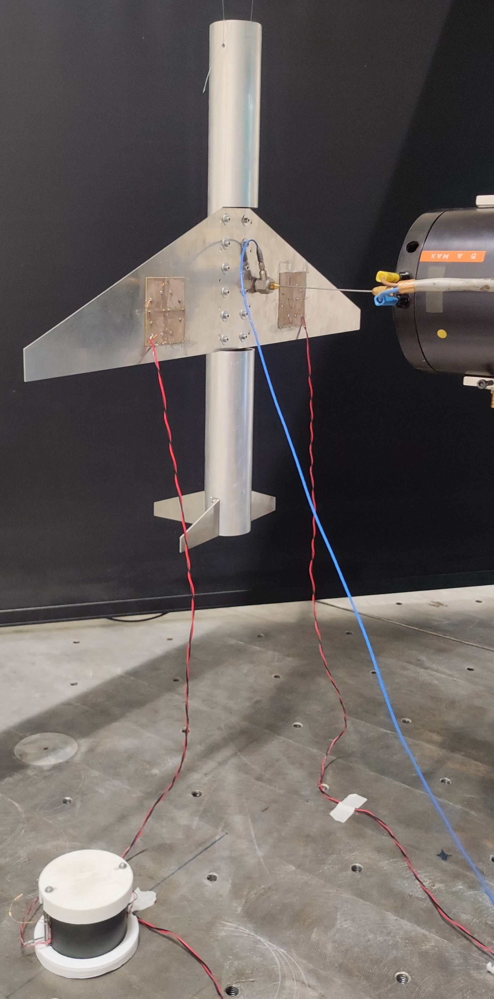
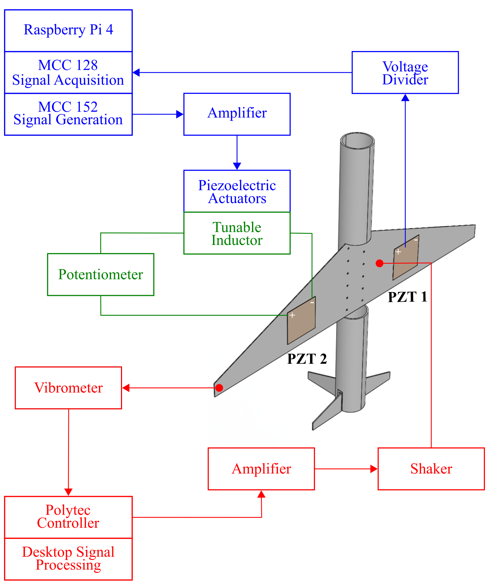

# SPARTA: Self-adaptive Piezoelectric pAssive vibRaTion Absorber

This repository contains the experimental data and Matlab/Python codes implemented in the paper "Self-adaptive piezoelectric vibration absorber with high-Q tunable
resonant shunt". 
\
\
Jessé Paixao, Emeline Sadoulet-Reboul, Emmanuel Foltête, Gaël Chevallier, Scott Cogan \
Department of Applied Mechanics, FEMTO-ST Institute

## Experimental Setup

    &ensp;         

## License
This repository is released under the MIT license. See [LICENSE](LICENSE) for additional details.

## Contact
Please feel free to contact us if you have any questions about the code.  
Email: jesse.dossantos@femto-st.fr
